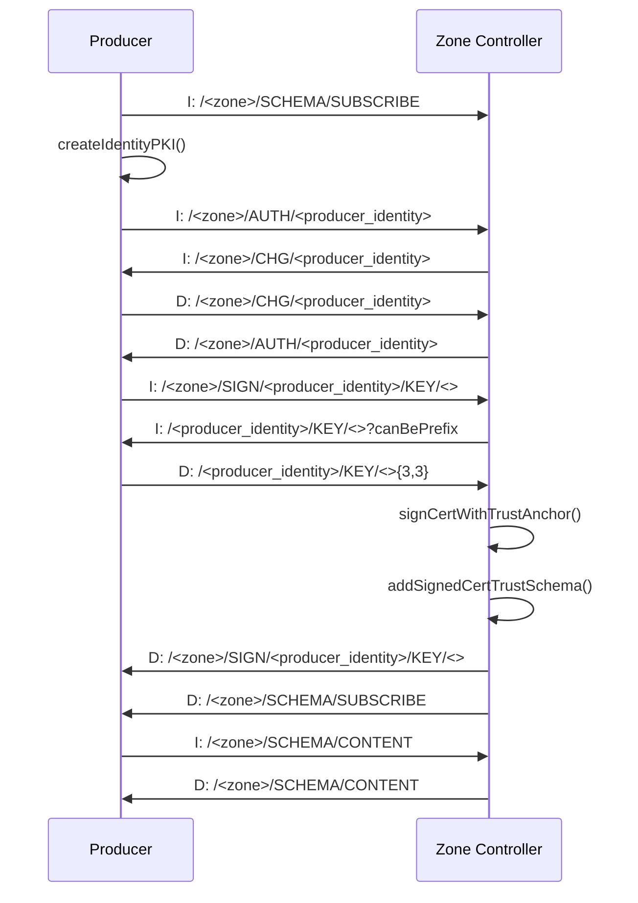

# Overview

**Summary**
- [Overview](#overview)
  - [Option 1 - Run project inside Docker (recommended)](#option-1---run-project-inside-docker-recommended)
  - [Option 2 - Run project inside Ubuntu VM](#option-2---run-project-inside-ubuntu-vm)
    - [INSTALL Dependencies - Instructions](#install-dependencies---instructions)
      - [INSTALL - NDNSIM](#install---ndnsim)
      - [INSTALL - BonnMotion mobility generator](#install---bonnmotion-mobility-generator)
      - [Setup](#setup)
      - [Run experiments](#run-experiments)
- [NDN Intertrust Design](#ndn-intertrust-design)
  - [Description](#description)
  - [Intrazone communication](#intrazone-communication)
    - [1. Assumptions](#1-assumptions)
    - [2. Bootstrapping](#2-bootstrapping)
      - [2.1. Producer PKI Creation](#21-producer-pki-creation)
      - [2.2. Producer Authentication](#22-producer-authentication)
      - [2.3. Producer Certificate Signing](#23-producer-certificate-signing)
      - [2.4. Update Trust Schema](#24-update-trust-schema)
    - [3. Bootstrapping Overview](#3-bootstrapping-overview)


This project can be run in either one of the following methods:

## Option 1 - Run project inside Docker (recommended)

Execute the following command:
```bash
bash ./docker-run.sh
```

An ```./ndnSIM``` folder will be created and populated with the required dependencies (ns-3, ndnSIM module, python bindings, bonnmotion, sim_bootsec project inside ```./ns-3/scratch``` folder).

Inside the terminal, type in the following to perform simulations:
```bash
cd ./scratch/sim_bootsec
./run.sh
```

The ```run.sh``` has some simulation paramters that can be changed, please check the file.

## Option 2 - Run project inside Ubuntu VM

### INSTALL Dependencies - Instructions

Following NS3 code was tested under Ubuntu 20.04. It might work using other distros, but it is not guaranteed.

#### INSTALL - NDNSIM 

Execute the following in the bash terminal:
```bash
sudo apt-get update
sudo apt-get -y install vim git wget
sudo apt-get -y install build-essential libsqlite3-dev libboost-all-dev libssl-dev git python3-setuptools castxml
sudo apt-get -y install gir1.2-goocanvas-2.0 gir1.2-gtk-3.0 libgirepository1.0-dev python3-dev python3-gi python3-gi-cairo python3-pip python3-pygraphviz python3-pygccxml sudo pip3 install kiwi

cd ~
mkdir ndnSIM
cd ndnSIM
git clone -b ndnSIM-ns-3.30.1 https://github.com/named-data-ndnSIM/ns-3-dev.git ns-3
git clone -b 0.21.0 https://github.com/named-data-ndnSIM/pybindgen.git pybindgen
git clone -b ndnSIM-2.8 --recursive https://github.com/named-data-ndnSIM/ndnSIM.git ns-3/src/ndnSIM
git submodule update --init

cd ns-3
./waf configure --enable-examples
./waf
```

#### INSTALL - BonnMotion mobility generator

Execute the following:
```bash
cd ~
wget -O jdk-21_linux-x64_bin.deb https://download.oracle.com/java/21/latest/jdk-21_linux-x64_bin.deb
sudo apt-get -y install ./jdk-21_linux-x64_bin.deb

wget -O bonnmotion-3.0.1.zip https://sys.cs.uos.de/bonnmotion/src/bonnmotion-3.0.1.zip
unzip bonnmotion-3.0.1.zip &&
rm bonnmotion-3.0.1.zip
cd bonnmotion-3.0.1
chmod +rx *.sh *.bat ./install
./install
mkdir -p ~/.local/bin
ln -sf ~/bonnmotion-3.0.1/bin/bm ~/.local/bin
chmod +rx ~/.local/bin/*
echo "export PATH=\$PATH:\$HOME/.local/bin" >> ~/.bash_aliases
. ~/.bash_aliases
```

#### Setup

Execute the following:
```bash
cd ~/ndnSIM/ns-3/scratch
git clone git@github.com:andre-romano/ndn-secure-bootstrap.git sim_bootsec
chmod +rx -R sim_bootsec/*
```

#### Run experiments

Execute the following:

```bash
cd ~/ndnSIM/ns-3/scratch/ndn-secure-bootstrap
./run.sh
```

You can pass parameters to "run.sh", please check the script for more info

# NDN Intertrust Design

## Description
NDN's Intertrust proposal is a solution to allow for NDN Apps located in distinct NDN Zones (name domains) to communicate with each other. For this, they need to recognize and verify each others' trust schema. In this sense, Intertrust proposes that, for each request for content available in another NDN Zone, we include the trust schema rules of that Zone in our own trust schema file, of our Zone. For this, we need modify the schema and also sign the trust anchor of the other Zone with our trust schema. 

To the best of our knowledge, Up to this moment, no implementation of Intertrust has been performed. Therefore, we focus in implementing this solution in ndnSIM simulator.

## Intrazone communication

### 1. Assumptions
We assume that the following data has been shared among NDN entities in an out-of-band manner prior to any NDN communication:
- trust anchor (public certificate)
- trust schema (containing only the trust anchor rule)

### 2. Bootstrapping
To allow an NDN App to communicate in the intrazone network, that App needs to pass through a secure bootstrapping process that encompasses the following steps:
1) Create NDN Producer Identity/PKI (performed locally by the Producer itself)
2) Authenticate Producer (Zone Controller)
3) Sign Producer certificate with trust anchor, and send it back to Producer (Zone Controller)
4) Send updated Trust Schema to interested parties, both Consumers and Producers (Zone Controller)

These steps are described in further details in the following sections.

#### 2.1. Producer PKI Creation
When producer starts, it creates its PKI (private and public keys), as well as its public certificate. Then, it tries to authenticate with the Zone Controller. 

####  2.2. Producer Authentication
1) **Auth (Interest)**: The producers requests for authentication.
   - **Packet**: INTEREST
   - **Name**: ``/<zone>/AUTH/<producer_identity>``
2) **Challenge (Interest)**: Zone Controller requests a challenge response.
   - **Packet**: INTEREST
   - **Name**: ``/<zone>/CHG/<producer_identity>``
3) **Challenge (Data)**: The producer answers the challenge.
   - **Packet**: DATA
   - **Name**: ``/<zone>/CHG/<producer_identity>``
4) **Auth (Data)**: If the answer is correct, the Zone Controller sends an `ACK` reply. If not, it answers with `NACK`. 
   - **Packet**: DATA
   - **Name**: ``/<zone>/AUTH/<producer_identity>``
   - In case of a ``NACK`` reply, the Zone Controller could also choose not send the Data packet. That is, it will wait for the authentication protocol to timeout. This is to avoid potential DoS attacks.
   
####  2.3. Producer Certificate Signing
1) **Sign (Interest)**: The producers requests for certificate signing.
   - **Packet**: INTEREST
   - **Name**: ``/<zone>/SIGN/<producer_identity>/KEY/<>``
2) **KEY (Interest)**: Zone Controller requests the producer's certificate.
   - **Packet**: INTEREST
   - **Name**: ``/<producer_identity>/KEY/<>?canBePrefix``
3) **KEY (Data)**: The producer answers with its self-signed certificate.
   - **Packet**: DATA
   - **Name**: ``/<producer_identity>/KEY/<>{3,3}``
4) **Sign (Data)**: 
   1) The Zone Controller signs the certificate with the Zone's trust anchor.
   2) The Zone Controller sends the signed certificate back to the Producer, so that it can serve this certificate to Consumers, as they request it.
      - **Packet**: DATA
      - **Name**: ``/<zone>/SIGN/<producer_identity>/KEY/<>``

####  2.4. Update Trust Schema
1) The Zone Controller adds the Producer signed certificate to the trust schema validation rules.
2) The Zone Controller issues an update notification to interested parties (Consumers and Producers). We assume that interested parties have previously issued a subscribe Interest (``/<zone>/SCHEMA/SUBSCRIBE``) for the trust schema.
   - **Packet**: DATA
   - **Name**: ``/<zone>/SCHEMA/SUBSCRIBE``
3) Interested parties request the updated trust schema from Zone Controller
   - **Packet**: INTEREST
   - **Name**: ``/<zone>/SCHEMA/CONTENT``
4) Zone Controller replies with the updated trust schema
   - **Packet**: DATA
   - **Name**: ``/<zone>/SCHEMA/CONTENT``

### 3. Bootstrapping Overview
These following sequence diagram summarizes the bootstrapping process:

